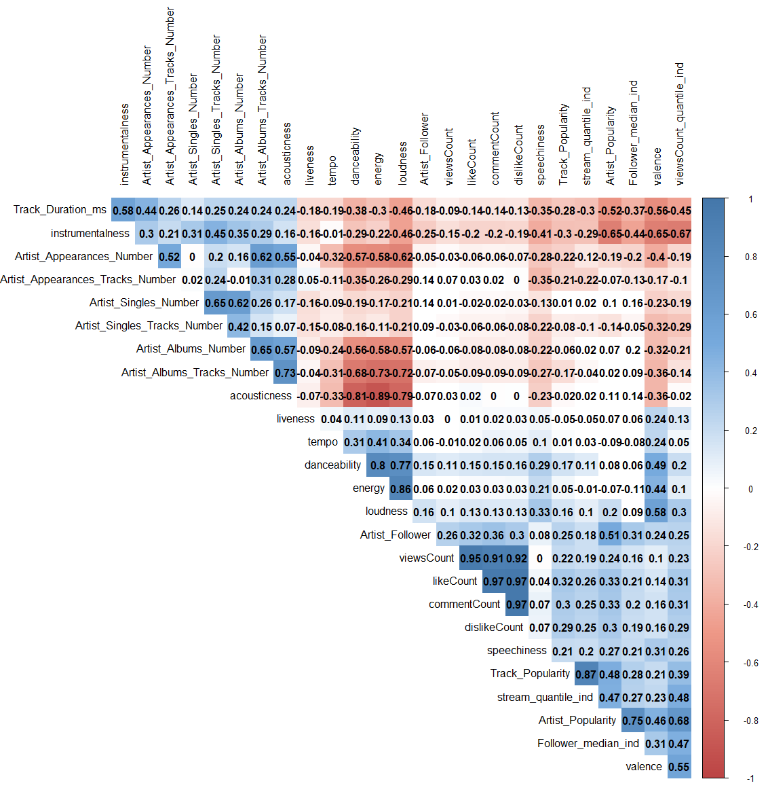

This is the mark-up file for the Datenanalyse 2 homework assignment.


```{r}
library("rio")
x <- import("https://docs.google.com/spreadsheets/d/1h7XhLd2Byp4OcXSdtxHly9iS7RA673RJ/export?format=csv&gid=1083477596")

str(x)

x$commentCount <- as.integer(x$commentCount)
x$viewsCount <- as.numeric(x$viewsCount)
x$acousticness <- as.numeric(sub(",", ".", x$acousticness, fixed = TRUE))
x$danceability <- as.numeric(sub(",", ".", x$danceability, fixed = TRUE))
x$energy <- as.numeric(sub(",", ".", x$energy, fixed = TRUE))
x$instrumentalness <- as.numeric(sub(",", ".", x$instrumentalness, fixed = TRUE))
x$liveness <- as.numeric(sub(",", ".", x$liveness, fixed = TRUE))
x$loudness <- as.numeric(sub(",", ".", x$loudness, fixed = TRUE))
x$speechiness <- as.numeric(sub(",", ".", x$speechiness, fixed = TRUE))
x$tempo <- as.numeric(sub(",", ".", x$tempo, fixed = TRUE))
x$valence <- as.numeric(sub(",", ".", x$valence, fixed = TRUE))

x$key <- as.factor(x$key)
x$time_signature <- as.factor(x$time_signature)


min_max_normalize <- function(x)
{
    return( (1000-10)*((x- min(x)) /(max(x)-min(x))) + 10)
}

x$acousticness <- min_max_normalize(x$acousticness)
x$danceability <- min_max_normalize(x$danceability)
x$energy <- min_max_normalize(x$energy)
x$instrumentalness <- min_max_normalize(x$instrumentalness)
x$liveness <- min_max_normalize(x$liveness)
x$loudness <- min_max_normalize(x$loudness)
x$speechiness <- min_max_normalize(x$speechiness)
x$tempo <- min_max_normalize(x$tempo)
x$valence <- min_max_normalize(x$valence)

x$Genre <- as.factor(x$Genre)
x$key <- as.factor(x$key)
x$mode <- as.factor(x$mode)
x$Charts <- as.factor(x$Charts)

```


```{r}
library("dplyr")

drop.cols <- c('Artist_ID', 'Genre', 'Release_Date', 'Track_Artist', 'Track_ID', 'Track_Title', 'video_ID', 'key', 'time_signature', 'Streams', 'Charts', 'mode', 'key')
numeric_x <- dplyr::select(x, -one_of(drop.cols))

keep.cols <- c('Artist_Follower', 'Track_Duration_ms', 'viewsCount', 'Track_Popularity', 'Artist_Popularity', 'danceability')

# keep.cols <- c('Streams', 'viewsCount', 'Title_Youtube_searches_11m')

selected_pairs <- dplyr::select(x, keep.cols)

pairs(selected_pairs, cex=0.5)

no_streams_nonan <- dplyr::select(x, -one_of('Streams'))
no_streams_nonan <- no_streams_nonan[complete.cases(no_streams_nonan), ]


```


Descriptive statistics

```{r}

numeric_x <- numeric_x[complete.cases(numeric_x), ]


summary(numeric_x)

```


Histograms and kernel density plots of base variables

```{r}

par(mfrow=c(3,3))

hist(x$Artist_Albums_Number, probability = TRUE, col = "gray")
lines(density(x$Artist_Albums_Number), col = "red")

hist(x$Artist_Albums_Tracks_Number, probability = TRUE, col = "gray")
lines(density(x$Artist_Albums_Tracks_Number), col = "red")

hist(x$Artist_Appearances_Number, probability = TRUE, col = "gray")
lines(density(x$Artist_Appearances_Number), col = "red")

hist(x$Artist_Appearances_Tracks_Number, probability = TRUE, col = "gray")
lines(density(x$Artist_Appearances_Tracks_Number), col = "red")

hist(x$Artist_Follower, probability = TRUE, col = "gray")
lines(density(x$Artist_Follower), col = "red")

hist(x$Artist_Popularity, probability = TRUE, col = "gray")
lines(density(x$Artist_Popularity), col = "red")

hist(x$Artist_Singles_Number, probability = TRUE, col = "gray")
lines(density(x$Artist_Singles_Number), col = "red")

hist(x$Artist_Singles_Tracks_Number, probability = TRUE, col = "gray")
lines(density(x$Artist_Singles_Tracks_Number), col = "red")

hist(x$Streams, probability = TRUE, col = "gray")
lines(density(x$Streams, na.rm = TRUE), col = "red")

```

```{r}

par(mfrow=c(3,3))

hist(x$Track_Duration_ms, probability = TRUE, col = "gray")
lines(density(x$Track_Duration_ms), col = "red")

hist(x$Track_Popularity, probability = TRUE, col = "gray")
lines(density(x$Track_Popularity), col = "red")

# hist(x$Title_Artist_Google_searches_11m, probability = TRUE, col = "gray")
# lines(density(x$Title_Artist_Google_searches_11m), col = "red")

# hist(x$Title_Artist_Youtube_searches_11m, probability = TRUE, col = "gray")
# lines(density(x$Title_Artist_Youtube_searches_11m), col = "red")

# hist(x$Title_Google_searches_11m, probability = TRUE, col = "gray")
# lines(density(x$Title_Google_searches_11m), col = "red")

# hist(x$Total_tracks, probability = TRUE, col = "gray")
# lines(density(x$Total_tracks), col = "red")

# hist(x$Artist_Google_searches_11m, probability = TRUE, col = "gray")
# lines(density(x$Artist_Google_searches_11m), col = "red")

# hist(x$Artist_Youtube_searches_11m, probability = TRUE, col = "gray")
# lines(density(x$Artist_Youtube_searches_11m), col = "red")

hist(x$commentCount, probability = TRUE, col = "gray")
lines(density(x$commentCount, na.rm = TRUE), col = "red")

```

```{r}
par(mfrow=c(3,3))

hist(x$dislikeCount, probability = TRUE, col = "gray")
lines(density(x$dislikeCount, na.rm = TRUE), col = "red")

hist(log(x$viewsCount), probability = TRUE, col = "gray")
lines(density(log(x$viewsCount), na.rm = TRUE), col = "red")

hist(x$acousticness, probability = TRUE, col = "gray")
lines(density(x$acousticness), col = "red")

hist(x$danceability, probability = TRUE, col = "gray")
lines(density(x$danceability), col = "red")

hist(x$energy, probability = TRUE, col = "gray")
lines(density(x$energy), col = "red")

hist(x$instrumentalness, probability = TRUE, col = "gray")
lines(density(x$instrumentalness), col = "red")

hist(x$liveness, probability = TRUE, col = "gray")
lines(density(x$liveness), col = "red")

hist(x$loudness, probability = TRUE, col = "gray")
lines(density(x$loudness), col = "red")

hist(x$speechiness, probability = TRUE, col = "gray")
lines(density(x$speechiness), col = "red")


```

```{r}

par(mfrow=c(1,2))

hist(x$tempo, probability = TRUE, col = "gray")
lines(density(x$tempo), col = "red")

hist(x$valence, probability = TRUE, col = "gray")
lines(density(x$valence), col = "red")

```


Distribution testing

1) Normality

```{r}

strictly_positive_variables <- c('Artist_Follower', 'Artist_Popularity', 'Track_Duration_ms', 'Track_Popularity', 'viewsCount', 'acousticness', 'danceability', 'energy', 'liveness', 'loudness', 'speechiness', 'tempo', 'valence')


summary(dplyr::select(x, strictly_positive_variables))


for (i in 1:length(strictly_positive_variables)){
  
  column_name <- strictly_positive_variables[i]
  
  message(column_name)
  
  sub_df <- numeric_x[column_name]
  
  sub_df <- sub_df[complete.cases(sub_df), ]
  
  #sub_df <- as.numeric(as.character(unlist(sub_df[[1]])))
  
  test_statistic <- ks.test(sub_df, "pnorm", mean=mean(sub_df), sd=sd(sub_df))$statistic
  critical_value <- 1.3581 / sqrt (length(sub_df))
  
  if (test_statistic > critical_value) {
message(paste(" ", column_name , " is not approximately normally distributed.", test_statistic, critical_value))
} else {
message(paste(" ", column_name , " is approximately normally distributed!", test_statistic, critical_value))  
}}


```

None of the strictly positive variables in their base specification passes the KS test.


2) Standard normality

```{r}


numeric_x_scaled <- scale(numeric_x, center = TRUE, scale = TRUE)
numeric_x_scaled <- as.data.frame(numeric_x_scaled)

par(mfrow=c(3,3))

hist(numeric_x_scaled$Artist_Albums_Number, probability = TRUE, col = "gray")
lines(density(numeric_x_scaled$Artist_Albums_Number), col = "red")

hist(numeric_x_scaled$Artist_Albums_Tracks_Number, probability = TRUE, col = "gray")
lines(density(numeric_x_scaled$Artist_Albums_Tracks_Number), col = "red")

hist(numeric_x_scaled$Artist_Appearances_Number, probability = TRUE, col = "gray")
lines(density(numeric_x_scaled$Artist_Appearances_Number), col = "red")

hist(numeric_x_scaled$Artist_Appearances_Tracks_Number, probability = TRUE, col = "gray")
lines(density(numeric_x_scaled$Artist_Appearances_Tracks_Number), col = "red")

hist(numeric_x_scaled$Artist_Follower, probability = TRUE, col = "gray")
lines(density(numeric_x_scaled$Artist_Follower), col = "red")

hist(numeric_x_scaled$Artist_Popularity, probability = TRUE, col = "gray")
lines(density(numeric_x_scaled$Artist_Popularity), col = "red")

hist(numeric_x_scaled$Artist_Singles_Number, probability = TRUE, col = "gray")
lines(density(numeric_x_scaled$Artist_Singles_Number), col = "red")

hist(numeric_x_scaled$Artist_Singles_Tracks_Number, probability = TRUE, col = "gray")
lines(density(numeric_x_scaled$Artist_Singles_Tracks_Number), col = "red")

# hist(numeric_x_scaled$Streams, probability = TRUE, col = "gray")
# lines(density(numeric_x_scaled$Streams, na.rm = TRUE), col = "red")

```

```{r}

par(mfrow=c(3,3))

hist(numeric_x_scaled$Track_Duration_ms, probability = TRUE, col = "gray")
lines(density(numeric_x_scaled$Track_Duration_ms), col = "red")

hist(numeric_x_scaled$Track_Popularity, probability = TRUE, col = "gray")
lines(density(numeric_x_scaled$Track_Popularity), col = "red")

# hist(numeric_x_scaled$Title_Artist_Google_searches_11m, probability = TRUE, col = "gray")
# lines(density(numeric_x_scaled$Title_Artist_Google_searches_11m), col = "red")

# hist(numeric_x_scaled$Title_Artist_Youtube_searches_11m, probability = TRUE, col = "gray")
# lines(density(numeric_x_scaled$Title_Artist_Youtube_searches_11m), col = "red")

# hist(numeric_x_scaled$Title_Google_searches_11m, probability = TRUE, col = "gray")
# lines(density(numeric_x_scaled$Title_Google_searches_11m), col = "red")

# hist(numeric_x_scaled$Total_tracks, probability = TRUE, col = "gray")
# lines(density(numeric_x_scaled$Total_tracks), col = "red")

#hist(numeric_x_scaled$Artist_Google_searches_11m, probability = TRUE, col = "gray")
#lines(density(numeric_x_scaled$Artist_Google_searches_11m), col = "red")

#hist(numeric_x_scaled$Artist_Youtube_searches_11m, probability = TRUE, col = "gray")
#lines(density(numeric_x_scaled$Artist_Youtube_searches_11m), col = "red")

hist(numeric_x_scaled$commentCount, probability = TRUE, col = "gray")
lines(density(numeric_x_scaled$commentCount, na.rm = TRUE), col = "red")
```

```{r}
par(mfrow=c(1,2))

hist(numeric_x_scaled$dislikeCount, probability = TRUE, col = "gray")
lines(density(numeric_x_scaled$dislikeCount, na.rm = TRUE), col = "red")

hist(log(x$viewsCount), probability = TRUE, col = "gray")
lines(density(log(x$viewsCount)), col = "red")

```

```{r}

for (i in 1:length(strictly_positive_variables)){
  
  column_name <- strictly_positive_variables[i]
  
  sub_df <- numeric_x_scaled[column_name]
  sub_df <- sub_df[complete.cases(sub_df), ]
  
  # sub_df <- as.numeric(as.character(unlist(sub_df[[1]])))
  
  test_statistic <- ks.test(sub_df, "pnorm", mean=mean(sub_df), sd=sd(sub_df))$statistic
  critical_value <- 1.3581 / sqrt (length(sub_df))
  
  if (test_statistic > critical_value) {
message(paste(" Z-transformed ", column_name , " is not approximately normally distributed.", test_statistic, critical_value))
} else {
message(paste(" Z-transformed ", column_name , " is approximately normally distributed!", test_statistic, critical_value))  
}}


```

Again, none of the z-transformed variables is approximately normally distributed, however only Track_Duration_ms is close to the critical value at $\alpha$ = 0.05.

3) Log-normality

```{r}

log_numeric_x <- log(numeric_x)

par(mfrow=c(3,3))

hist(log_numeric_x$Artist_Albums_Number, probability = TRUE, col = "gray")
lines(density(log_numeric_x$Artist_Albums_Number), col = "red")

hist(log_numeric_x$Artist_Albums_Tracks_Number, probability = TRUE, col = "gray")
lines(density(log_numeric_x$Artist_Albums_Tracks_Number), col = "red")

hist(log_numeric_x$Artist_Appearances_Number, probability = TRUE, col = "gray")
lines(density(log_numeric_x$Artist_Appearances_Number), col = "red")

hist(log_numeric_x$Artist_Appearances_Tracks_Number, probability = TRUE, col = "gray")
lines(density(log_numeric_x$Artist_Appearances_Tracks_Number), col = "red")

hist(log_numeric_x$Artist_Follower, probability = TRUE, col = "gray")
lines(density(log_numeric_x$Artist_Follower), col = "red")

hist(log_numeric_x$Artist_Popularity, probability = TRUE, col = "gray")
lines(density(log_numeric_x$Artist_Popularity), col = "red")

hist(log_numeric_x$Artist_Singles_Number, probability = TRUE, col = "gray")
lines(density(log_numeric_x$Artist_Singles_Number), col = "red")

hist(log_numeric_x$Artist_Singles_Tracks_Number, probability = TRUE, col = "gray")
lines(density(log_numeric_x$Artist_Singles_Tracks_Number), col = "red")

#hist(log_numeric_x$Streams, probability = TRUE, col = "gray")
#lines(density(log_numeric_x$Streams, na.rm = TRUE), col = "red")

```

```{r}

par(mfrow=c(3,3))

hist(log_numeric_x$Track_Duration_ms, probability = TRUE, col = "gray")
lines(density(log_numeric_x$Track_Duration_ms), col = "red")

hist(log_numeric_x$Track_Popularity, probability = TRUE, col = "gray")
lines(density(log_numeric_x$Track_Popularity), col = "red")

#hist(log_numeric_x$Title_Artist_Google_searches_11m, probability = TRUE, col = "gray")
#lines(density(log_numeric_x$Title_Artist_Google_searches_11m), col = "red")

#hist(log_numeric_x$Title_Artist_Youtube_searches_11m, probability = TRUE, col = "gray")
#lines(density(log_numeric_x$Title_Artist_Youtube_searches_11m), col = "red")

#hist(log_numeric_x$Title_Google_searches_11m, probability = TRUE, col = "gray")
#lines(density(log_numeric_x$Title_Google_searches_11m), col = "red")

#hist(log_numeric_x$Total_tracks, probability = TRUE, col = "gray")
#lines(density(log_numeric_x$Total_tracks), col = "red")

#hist(log_numeric_x$Artist_Google_searches_11m, probability = TRUE, col = "gray")
#lines(density(log_numeric_x$Artist_Google_searches_11m), col = "red")

#hist(log_numeric_x$Artist_Youtube_searches_11m, probability = TRUE, col = "gray")
#lines(density(log_numeric_x$Artist_Youtube_searches_11m), col = "red")

hist(log_numeric_x$commentCount, probability = TRUE, col = "gray")
lines(density(log_numeric_x$commentCount, na.rm = TRUE), col = "red")

```


```{r}
par(mfrow=c(1,2))

hist(log_numeric_x$dislikeCount, probability = TRUE, col = "gray")
lines(density(log_numeric_x$dislikeCount, na.rm = TRUE), col = "red")

hist(log_numeric_x$viewsCount, probability = TRUE, col = "gray")
lines(density(log_numeric_x$viewsCount), col = "red")

```


```{r}

for (i in 1:length(strictly_positive_variables)){
  
  column_name <- strictly_positive_variables[i]
  
  sub_df <- numeric_x[column_name]
  sub_df <- sub_df[complete.cases(sub_df), ]
  sub_df <- sub_df[sub_df > 1]
  sub_df <- log(sub_df)
  # sub_df <- as.numeric(as.character(unlist(sub_df[[1]])))
  
  test_statistic <- ks.test(sub_df, "pnorm", mean=mean(sub_df), sd=sd(sub_df))$statistic
  critical_value <- 1.3581 / sqrt (length(sub_df))
  
  if (test_statistic > critical_value) {
message(paste(" Log-transformed ", column_name , " is not approximately normally distributed.", test_statistic, critical_value))
} else {
message(paste(" Log-ransformed ", column_name , " is approximately normally distributed!", test_statistic, critical_value))  
}}


```

After log-transforming the variables, streams and viewsCount are approximately normally distributed, so we can proceed with testing whether they are also jointly (log-) normally distributed.

$H_0$: two variables are jointly normal distributed 
$H_1$: two variables are not jointly normal distributed

```{r}

bivariate_df1 <- dplyr::select(x, c('Streams', 'viewsCount'))

bivariate_df1 <- bivariate_df1[complete.cases(bivariate_df1), ]

bivariate_df1 <- log(bivariate_df1)

plot(bivariate_df1$viewsCount, bivariate_df1$Streams)

# install.packages("MVN")

library("MVN")

mvn(bivariate_df1, mvnTest = "mardia")$multivariateNormality # Not jointly normal
mvn(bivariate_df1, mvnTest = "hz")$multivariateNormality # Not jointly normal
mvn(bivariate_df1, mvnTest = "royston")$multivariateNormality # 
mvn(bivariate_df1, mvnTest = "energy")$multivariateNormality

```

Result: all tests reject the Null hypothesis that the two variables log-Streams and log-viewsCount are jointly normally distributed. Hence, Steiger's Z test cannot be meaningfully conducted. All results displayed in the correlogram are thefore to be treated with caution.


4) Box-Cox transformations


```{r}

library("psych")
library("car")

ksD <- function (p, x) {
  y <- bcPower(x, p)
  ks.test(y, "pnorm", mean=mean(y), sd=sd(y))$statistic
}

oldw <- getOption("warn")
options(warn = -1)

min_values <- c()

for (column_index in 1:length(strictly_positive_variables)){
  
  column_name <- strictly_positive_variables[column_index]
  
  # x_sub <- as.numeric(x[[paste(column_name)]])
  
  x_sub <- numeric_x[[paste(column_name)]]
  
  # x_sub <- x_sub[complete.cases(x_sub)]
  
  result <- optimize(ksD, c(-5,5), x=x_sub)
  
  min_values[column_index] <- result$minimum
  
  message(paste(column_index, ', minimum value is: ', result$minimum))
  
}


min_stream_val <- optimize(ksD, c(-5,5), x=bivariate_df1$Streams)$minimum
min_viewsCount_val <- optimize(ksD, c(-5,5), x=bivariate_df1$viewsCount)$minimum


options(warn = oldw)

```

Box-Cox transformations

```{r}

par(mfrow=c(2,5))

column_index <- 1
column_name <- strictly_positive_variables[column_index]
#x_sub <- as.numeric(x[[paste(column_name)]])
#x_sub <- x_sub[complete.cases(x_sub)]
x_sub <- numeric_x[[paste(column_name)]]
Artist_Follower_trans <- bcPower(x_sub, min_values[column_index])

column_index <- 2
column_name <- strictly_positive_variables[column_index]
#x_sub <- as.numeric(x[[paste(column_name)]])
#x_sub <- x_sub[complete.cases(x_sub)]
x_sub <- numeric_x[[paste(column_name)]]
Artist_Popularity_trans <- bcPower(x_sub, min_values[column_index])

#column_index <- 3
#column_name <- strictly_positive_variables[column_index]
#x_sub <- as.numeric(x[[paste(column_name)]])
#Artist_Singles_Number_trans <- bcPower(x_sub, min_values[column_index])

#column_index <- 4
#column_name <- strictly_positive_variables[column_index]
#x_sub <- as.numeric(x[[paste(column_name)]])
#Artist_Singles_Tracks_Number_trans <- bcPower(x_sub, min_values[column_index])

#column_index <- 3
#column_name <- strictly_positive_variables[column_index]
#x_sub <- as.numeric(x[[paste(column_name)]])
#x_sub <- x_sub[complete.cases(x_sub)]
#x_sub <- numeric_x[[paste(column_name)]]
#Streams_trans <- bcPower(x_sub, min_values[column_index])

column_index <- 3
column_name <- strictly_positive_variables[column_index]
#x_sub <- as.numeric(x[[paste(column_name)]])
#x_sub <- x_sub[complete.cases(x_sub)]
x_sub <- numeric_x[[paste(column_name)]]
Track_Duration_ms_trans <- bcPower(x_sub, min_values[column_index])

#column_index <- 7
#column_name <- strictly_positive_variables[column_index]
#x_sub <- as.numeric(x[[paste(column_name)]])
#Total_tracks_trans <- bcPower(x_sub, min_values[column_index])

column_index <- 4
column_name <- strictly_positive_variables[column_index]
#x_sub <- as.numeric(x[[paste(column_name)]])
#x_sub <- x_sub[complete.cases(x_sub)]
x_sub <- numeric_x[[paste(column_name)]]
Track_Popularity_trans <- bcPower(x_sub, min_values[column_index])


column_index <- 5
column_name <- strictly_positive_variables[column_index]
#x_sub <- as.numeric(x[[paste(column_name)]])
#x_sub <- x_sub[complete.cases(x_sub)]
x_sub <- numeric_x[[paste(column_name)]]
viewsCount_trans <- bcPower(x_sub, min_values[column_index])

#column_index <- 9
#column_name <- strictly_positive_variables[column_index]
#x_sub <- as.numeric(x[[paste(column_name)]])
#Artist_Google_searches_11m_trans <- bcPower(x_sub, min_values[column_index])

#column_index <- 10
#column_name <- strictly_positive_variables[column_index]
#x_sub <- as.numeric(x[[paste(column_name)]])
#Artist_Youtube_searches_11m_trans <- bcPower(x_sub, min_values[column_index])

column_index <- 6
column_name <- strictly_positive_variables[column_index]
#x_sub <- as.numeric(x[[paste(column_name)]])
#x_sub <- x_sub[complete.cases(x_sub)]
x_sub <- numeric_x[[paste(column_name)]]
acousticness_trans <- bcPower(x_sub, min_values[column_index])

column_index <- 7
column_name <- strictly_positive_variables[column_index]
#x_sub <- as.numeric(x[[paste(column_name)]])
#x_sub <- x_sub[complete.cases(x_sub)]
x_sub <- numeric_x[[paste(column_name)]]
danceability_trans <- bcPower(x_sub, min_values[column_index])

column_index <- 8
column_name <- strictly_positive_variables[column_index]
#x_sub <- as.numeric(x[[paste(column_name)]])
#x_sub <- x_sub[complete.cases(x_sub)]
x_sub <- numeric_x[[paste(column_name)]]
energy_trans <- bcPower(x_sub, min_values[column_index])

column_index <- 9
column_name <- strictly_positive_variables[column_index]
#x_sub <- as.numeric(x[[paste(column_name)]])
#x_sub <- x_sub[complete.cases(x_sub)]
x_sub <- numeric_x[[paste(column_name)]]
liveness_trans <- bcPower(x_sub, min_values[column_index])

column_index <- 10
column_name <- strictly_positive_variables[column_index]
#x_sub <- as.numeric(x[[paste(column_name)]])
#x_sub <- x_sub[complete.cases(x_sub)]
x_sub <- numeric_x[[paste(column_name)]]
loudness_trans <- bcPower(x_sub, min_values[column_index])

column_index <- 11
column_name <- strictly_positive_variables[column_index]
#x_sub <- as.numeric(x[[paste(column_name)]])
#x_sub <- x_sub[complete.cases(x_sub)]
x_sub <- numeric_x[[paste(column_name)]]
speechiness_trans <- bcPower(x_sub, min_values[column_index])

column_index <- 12
column_name <- strictly_positive_variables[column_index]
#x_sub <- as.numeric(x[[paste(column_name)]])
#x_sub <- x_sub[complete.cases(x_sub)]
x_sub <- numeric_x[[paste(column_name)]]
tempo_trans <- bcPower(x_sub, min_values[column_index])

column_index <- 13
column_name <- strictly_positive_variables[column_index]
#x_sub <- as.numeric(x[[paste(column_name)]])
#x_sub <- x_sub[complete.cases(x_sub)]
x_sub <- numeric_x[[paste(column_name)]]
valence_trans <- bcPower(x_sub, min_values[column_index])

streams_trans_sub <- bcPower(bivariate_df1$Streams, min_stream_val)
viewsCount_trans_sub <- bcPower(bivariate_df1$viewsCount, min_viewsCount_val)

hist_trans_list <- list(Artist_Follower_trans, Artist_Popularity_trans, Track_Duration_ms_trans, Track_Popularity_trans,
                     viewsCount_trans, acousticness_trans, danceability_trans, energy_trans, liveness_trans, 
                     loudness_trans, speechiness_trans, tempo_trans, valence_trans)

for (trans_index in 1:length(hist_trans_list)){
  
  column_name <- strictly_positive_variables[trans_index]
  
  message(column_name)
  
  selected_trans <- hist_trans_list[trans_index]
  selected_trans <- as.numeric(as.character(unlist(selected_trans[[1]])))
  
  hist(selected_trans, col = "gray", probability = TRUE, main = "Histogram of Box-Cox transformed", xlab = column_name)
  points(seq(min(selected_trans), max(selected_trans), length.out = 500),
       dnorm(seq(min(selected_trans), max(selected_trans), length.out = 500),
             mean(selected_trans),sd(selected_trans)), type = "l", col = "red")
  
  test_statistic <- ks.test(selected_trans, "pnorm", mean=mean(selected_trans), sd=sd(selected_trans))$statistic
  critical_value <- 1.3581 / sqrt (length(selected_trans))
  
  if (test_statistic > critical_value) {
message(paste("Transformed ", column_name , " is not approximately normally distributed.", test_statistic, critical_value))
} else {
message(paste("Transformed ", column_name , " is approximately normally distributed!", test_statistic, critical_value))  
}}

hist(streams_trans_sub, col = "gray", probability = TRUE, main = "Histogram of Box-Cox transformed", xlab = 'Streams sub')
points(seq(min(streams_trans_sub), max(streams_trans_sub), length.out = 500),
       dnorm(seq(min(streams_trans_sub), max(streams_trans_sub), length.out = 500),
             mean(streams_trans_sub),sd(streams_trans_sub)), type = "l", col = "red")

test_statistic <- ks.test(streams_trans_sub, "pnorm", mean=mean(streams_trans_sub), sd=sd(streams_trans_sub))$statistic
critical_value <- 1.3581 / sqrt (length(streams_trans_sub))
  
  if (test_statistic > critical_value) {
message(paste("Transformed Streams_sub is not approximately normally distributed.", test_statistic, critical_value))
} else {
message(paste("Transformed Streams_sub is approximately normally distributed!", test_statistic, critical_value))  
}


hist(viewsCount_trans_sub, col = "gray", probability = TRUE, main = "Histogram of Box-Cox transformed", xlab = 'viewsCount sub')
points(seq(min(viewsCount_trans_sub), max(viewsCount_trans_sub), length.out = 500),
       dnorm(seq(min(viewsCount_trans_sub), max(viewsCount_trans_sub), length.out = 500),
             mean(viewsCount_trans_sub),sd(viewsCount_trans_sub)), type = "l", col = "red")

test_statistic <- ks.test(viewsCount_trans_sub, "pnorm", mean=mean(viewsCount_trans_sub), sd=sd(viewsCount_trans_sub))$statistic
critical_value <- 1.3581 / sqrt (length(viewsCount_trans_sub))
  
  if (test_statistic > critical_value) {
message(paste("Transformed viewsCount_sub is not approximately normally distributed.", test_statistic, critical_value))
} else {
message(paste("Transformed viewsCount_sub is approximately normally distributed!", test_statistic, critical_value))  
}


#test_statistic <- ks.test(Artist_Follower_trans, "pnorm", mean=mean(Artist_Follower_trans), sd=sd(Artist_Follower_trans))$statistic
#critical_value <- 1.3581 / sqrt (length(x_sub))

#if (test_statistic > critical_value) {
#message(paste("Transformed ", column_name , " is not approximately normally distributed.", test_statistic, critical_value))
#} else {
#message(paste("Transformed ", column_name , " is approximately normally distributed!", test_statistic, critical_value))  
#}


```


Again, after Box-Cox transforming the variables with $\lambda$ equal to the optimized, minimum value to pass the KS test only viewsCount appears to be approximately normally distributed. Similarly, Streams is close to passing the KS test and therefore I'll also test for joint normality using the optimally Box-Cox-transformed variables.


```{r}

plot(viewsCount_trans_sub, streams_trans_sub)

bivariate_df2 <- data.frame(viewsCount_trans_sub, streams_trans_sub)

mvn(bivariate_df2, mvnTest = "mardia")$multivariateNormality # Not jointly normal
mvn(bivariate_df2, mvnTest = "hz")$multivariateNormality # Not jointly normal
mvn(bivariate_df2, mvnTest = "royston")$multivariateNormality # 
mvn(bivariate_df2, mvnTest = "energy")$multivariateNormality


```

Result: all tests reject the Null hypothesis that the two variables optimal Box-Cox-Streams and optimal Box-Cox-viewsCount are jointly normally distributed. 


Table by genre

```{r}

table(no_streams_nonan$Genre)

```


```{r}

##1

col <- ifelse(no_streams_nonan$Genre == "Techno", "black", "red")

plot(no_streams_nonan$Artist_Popularity, no_streams_nonan$Track_Popularity, main="Track Popularity", pch=19, col=col)

plot(log(no_streams_nonan$Artist_Popularity), log(no_streams_nonan$Track_Popularity), main="Track Popularity", pch=19, col=col)


```

```{r}

library("lattice")
xyplot(Track_Popularity~Artist_Popularity|Genre, data=no_streams_nonan, pch=19)
# xyplot(log(no_streams_nonan$Track_Popularity)~log(no_streams_nonan$Artist_Popularity)|x$Genre, pch=19)

```

```{r}

library("ggplot2")

d <-ggplot(no_streams_nonan, aes(x=as.integer(Artist_Popularity), y=as.integer(Track_Popularity), colour=Genre))
d + geom_point(shape=19)

# d <-ggplot(x, aes(x=log(viewsCount), y=log(Track_Popularity), colour=Genre))
# d + geom_point(shape=19)

```

Using sunflower plot to overcome problem of overplotting.

```{r}

sunflower_Artist_pop <- 2*round(no_streams_nonan$Artist_Popularity/2)
sunflower_Track_pop  <- 2*round(no_streams_nonan$Track_Popularity/2)
sunflowerplot(sunflower_Track_pop~sunflower_Artist_pop)

```

```{r}
library("Rmpfr")

# (one <- mpfr(1, 120))

cor <- cor(numeric_x)
drop.cor_cols <- c('Artist_Compilations_Number', 'Artist_Compilations_Tracks_Number', 'Streams')
numeric_cor_x <- dplyr::select(numeric_x, -one_of(drop.cor_cols))

numeric_cor_x$viewsCount <- as.numeric(numeric_cor_x$viewsCount)

str(numeric_cor_x)

clean_cor <- cor(numeric_cor_x[complete.cases(numeric_cor_x), ])
heatmap(clean_cor, revC=T, col=topo.colors(10))

```

```{r}
library("lattice")
levelplot(clean_cor, scales=list(x=list(rot=90)), aspect = "fill", col.regions=heat.colors(100))


```

```{r}
library("gplots")
gplots::heatmap.2(clean_cor, revC=T, na.rm=T)

```

Tests for significance of Bravais-Pearson, Spearman and Kendall correlation coefficients 

```{r}

x <- no_streams_nonan

x$stream_quantile_ind <- 0

stream_quantiles <- quantile(x$Track_Popularity, probs = c(0.25, 0.5, 0.75))

streams_q_25 <- stream_quantiles[1]
streams_median <- stream_quantiles[2]
streams_q_75 <- stream_quantiles[3]

x$stream_quantile_ind <- ifelse(x$Track_Popularity < streams_q_25, 1, x$stream_quantile_ind + 0)
x$stream_quantile_ind <- ifelse(((x$Track_Popularity >= streams_q_25) & (x$Track_Popularity < streams_median)), 2, x$stream_quantile_ind + 0)
x$stream_quantile_ind <- ifelse(((x$Track_Popularity >= streams_median) & (x$Track_Popularity < streams_q_75)), 3, x$stream_quantile_ind + 0)
x$stream_quantile_ind <- ifelse((x$Track_Popularity >= streams_q_75), 4, x$stream_quantile_ind + 0)

# bottom_25 <- subset(x , Streams < q_25)
# top_50_75 <- subset(x, Streams >= q_25 & Streams < median)
# top_25_50 <- subset(x , Streams >= median & Streams < q_75)
# top_25 <- subset(x, Streams >= q_75)

x$stream_quantile_ind <- as.factor(x$stream_quantile_ind)
x$Genre <- as.factor(x$Genre)

tab<-table(x$Genre, x$stream_quantile_ind)
tab

# critical Chi^2 value (df= 27): 40.11

chisq.test(tab)
chisq.test(tab, simulate.p.value = TRUE)

library("vcd")
assocstats(tab)

```

The p-value is smaller than the confidence level $\alpha$ = 0.05, hence we reject the Null hypothesis of no independence and conclude that there exists a dependence between the songs' genre and their placement within the four quantile ranges of the distribution of their popularity.
Cramer's V (~0.33) suggests that there is a semi-weak dependence between the ranking of a track and its genre.


```{r}

x$viewsCount_quantile_ind <- 0

viewsCount_quantiles <- quantile(x$viewsCount, probs = c(0.25, 0.5, 0.75))

viewsCount_q_25 <- viewsCount_quantiles[1]
viewsCount_median <- viewsCount_quantiles[2]
viewsCount_q_75 <- viewsCount_quantiles[3]

x$viewsCount_quantile_ind <- ifelse(x$viewsCount < viewsCount_q_25, 1, x$viewsCount_quantile_ind + 0)
x$viewsCount_quantile_ind <- ifelse(((x$viewsCount >= viewsCount_q_25) & (x$viewsCount < viewsCount_median)), 2, x$viewsCount_quantile_ind + 0)
x$viewsCount_quantile_ind <- ifelse(((x$viewsCount >= viewsCount_median) & (x$viewsCount < viewsCount_q_75)), 3, x$viewsCount_quantile_ind + 0)
x$viewsCount_quantile_ind <- ifelse((x$viewsCount >= viewsCount_q_75), 4, x$viewsCount_quantile_ind + 0)

# bottom_25 <- subset(x , Streams < q_25)
# top_50_75 <- subset(x, Streams >= q_25 & Streams < median)
# top_25_50 <- subset(x , Streams >= median & Streams < q_75)
# top_25 <- subset(x, Streams >= q_75)

x$viewsCount_quantile_ind <- as.factor(x$viewsCount_quantile_ind)

tab<-table(x$Genre, x$viewsCount_quantile_ind)
tab

# critical Chi^2 value (df= 27): 40.11

chisq.test(tab)
chisq.test(tab, simulate.p.value = TRUE)

library("vcd")
assocstats(tab)

```

The p-value is smaller than the confidence level $\alpha$ = 0.05, hence we reject the Null hypothesis of no independence and conclude that there exists a dependence between the songs' genre and their placement within the four quantile ranges of the distribution of their views on Youtube.
Cramer's V (~0.46) suggests that there is a semi-strong dependence between the ranking of a music video and its genre.


```{r}

x$Follower_median_ind <- 0

Follower_median <- median(x$Artist_Follower)

x$Follower_median_ind <- ifelse(x$Artist_Follower < Follower_median, 0, 1)
x$Follower_median_ind <- as.factor(x$Follower_median_ind)

tab<-table(x$Genre, x$Follower_median_ind)
tab

# critical Chi^2 value (df= 27): 40.11

chisq.test(tab)
chisq.test(tab, simulate.p.value = TRUE)
assocstats(tab)

# kendall's tau for stream quantile and follower median

ab2 <- na.omit(cbind(x$stream_quantile_ind, x$Follower_median_ind))

library("ryouready")
ord.tau(table(ab2[,1], ab2[,2]))

cor(as.numeric(x$stream_quantile_ind), as.numeric(x$Follower_median_ind), method = "kendall") # identical result

cor.test(as.numeric(x$stream_quantile_ind), as.numeric(x$Follower_median_ind), method="kendall")


```

The relationship between genre and whether the track's artist's follower count is smaller than the median value (=0) or not (=1) appears to be significant and strong, as suggested by the $\chi^2$-Test and Cramer's V (~0.6).

The relationship between stream quantiles and the follower > median indicator variable appears to be positive (about 0.25) and is significant at the $\alpha$ = 0.01 level. 

Let's see whether there exists an ordinal relationship between the placement of track popularity within the distributional range and the placement of the corresponding music video's views: 

```{r}

ab2 <- na.omit(cbind(x$stream_quantile_ind, x$viewsCount_quantile_ind))
nrow(ab2)*(nrow(ab2)-1)/2
#
ind <- order(ab2[,1], ab2[,2])
ab2 <- ab2[ind,]
#b
C <- D <- Tx <- Ty <- Txy <- 0
for (i in 1:(nrow(ab2)-1)) {
  if (i%%100==0) cat(i, "\n")
  for(j in (i+1):nrow(ab2)) {
    if (ab2[i,1]==ab2[j,1]) {
      if (ab2[i,2]==ab2[j,2]) {
        Txy <- Txy+1
      } else {
        Tx <- Tx+(ab2[i,2]<ab2[j,2])
      }
    } else {   
      if (ab2[i,2]==ab2[j,2]) Ty <- Ty+1
      if (ab2[i,2]<ab2[j,2]) C <- C+1
      if (ab2[i,2]>ab2[j,2]) D <- D+1
    }
  }
}

c(C=C, D=D, Tx=Tx, Ty=Ty, Txy=Txy)

k_t <- (C - D)/(nrow(ab2)*(nrow(ab2)-1)/2)
k_t # (without ties)

library("ryouready")
ord.tau(table(ab2[,1], ab2[,2]))

cor(as.numeric(x$stream_quantile_ind), as.numeric(x$viewsCount_quantile_ind), method = "kendall") # identical result

cor.test(as.numeric(x$stream_quantile_ind), as.numeric(x$viewsCount_quantile_ind), method="kendall")

tab<-table(x$stream_quantile_ind, x$viewsCount_quantile_ind)
chisq.test(tab)
chisq.test(tab, simulate.p.value = TRUE)

library("vcd")
assocstats(tab)

```

The rank correlation coefficient by Kendall's Tau (here for a quadratic table) is around 0.41 and the test yields that this coefficient is significant, hence we can conclude that there exists a positive relationship between the placement of track popularity of a song on Spotify and the placement of views of the corresponding music video on Youtube, meaning a higher rank of the song's music video in Youtube views is associated with a higher rank inside of Spotify's streams.

Even if not appropriate since the two variables have an ordinal scale and using $\chi^2$ test for independence would neglect additional information, Cramer's V (~0.38) states there exists a semi-weak relationship but without inferring anything about the direction of the relationship, only the strength of this relationship. Therefore, Kendall's Tau gives us the appropriate estimate, indicating the positive relationship between the two ordinal variables.

```{r}

numeric_cor_x$stream_quantile_ind <- as.numeric(x$stream_quantile_ind)
numeric_cor_x$viewsCount_quantile_ind <- as.numeric(x$viewsCount_quantile_ind)
numeric_cor_x$Follower_median_ind <- as.numeric(x$Follower_median_ind)

clean_cor <- cor(numeric_cor_x[complete.cases(numeric_cor_x), ])

library(corrplot)

corrplot(clean_cor, method="circle")

cor.mtest <- function(mat, ...) {
  mat <- as.matrix(mat)
  n <- ncol(mat)
  p.mat<- matrix(NA, n, n)
  diag(p.mat) <- 0
  for (i in 1:(n - 1)) {
    for (j in (i + 1):n) {
      tmp <- cor.test(mat[, i], mat[, j], ..., method = "spearman")
      p.mat[i, j] <- p.mat[j, i] <- tmp$p.value
    }
  }
  colnames(p.mat) <- rownames(p.mat) <- colnames(mat)
  p.mat
}

# matrix of the p-value of the correlation
p.mat <- cor.mtest(clean_cor)

col <- colorRampPalette(c("#BB4444", "#EE9988", "#FFFFFF", "#77AADD", "#4477AA"))
significance_level <- 0.05

corrplot(clean_cor, method="color", col=col(200),  
         type="upper", order="hclust", 
         addCoef.col = "black", # Add coefficient of correlation
         tl.col="black", tl.srt=90, #Text label color and rotation
         # Combine with significance
         p.mat = p.mat, sig.level = significance_level, insig = "blank", 
         # hide correlation coefficient on the principal diagonal
         diag=FALSE)


```




Prediction Reduction Error measures

Goodmann and Kruskals $\lambda$

1) predicting track popularity quantile without any knowledge about association with view quantiles, just taking the mode as predictor

2) predicting track popularity quantile with knowledge about track's corresponding placement in video view distribution

```{r}

modetab <- function(x, margin=0) { 
  if (margin>0) apply(x, margin, max) else max(x) 
}

tab2 <- table(numeric_cor_x$stream_quantile_ind, 
              numeric_cor_x$viewsCount_quantile_ind, dnn = c("Song streams", "Video views"))

tab2

tab <- rowSums(tab2)

message(paste("The mode across all four quantiles of stream distribution is", modetab(tab), " and is in the 2nd quantile"))

e1_streams <- sum(tab) - modetab(tab)

message(paste("Without any knowledge about an additional feature other than music streams itself and using the mode across classes as best predictor for class assignment for a new observation, the number of falsely predicted cases would be: ", e1_streams, " or ", e1_streams/sum(tab)*100, "%."))

e2_streams <- sum(tab2) - sum(modetab(tab2, 2))

message(paste("Now having knowledge about an association between track streams and its video views and using class-internal modes for the additional feature, the number of falsely predicted cases would be: ", e2_streams, " or ", e2_streams/sum(tab), "%, which is already much lower compared to the error rate from predicting without any knowledge about an association. On the other hand, ", sum(tab2)-e2_streams, " or ", (sum(tab2)-e2_streams)/sum(tab2)*100, "% would have been predicted correctly (compared to ", (1-e1_streams/sum(tab))*100, "% if there was no knowledge about video views classes.)"))

message("For example, the best prediction for a song that resided within the bottom quantile of video views would be that it resides inside of the 2nd quantile of streams as the mode of 27 was found to be from this class. Hence, using the class mode of the lower bottom quantile video views to predict 2nd quantile streams would yield 27 correct cases but 49-27= 22 misclassified predictions.")

lambda <- (e1_streams - e2_streams)/e1_streams

message(paste("Therefore, Goodmann and Kruskals Lambda is: ", lambda))

library("ryouready")

nom.lambda(tab2)


```

1) predicting stream quantile without any knowledge about association with genre, just taking the mode as predictor

2) predicting stream quantile with knowledge about track's genre

```{r}

tab2 <- table(numeric_cor_x$stream_quantile_ind, 
              x$Genre, dnn = c("Song streams", "Genre"))

tab2

tab <- rowSums(tab2)

message(paste("The mode across all four quantiles of stream distribution is", modetab(tab), " which is from the 2nd quantile."))


e1_streams <- sum(tab) - modetab(tab)

message(paste("Without any knowledge about an additional feature other than music streams itself and using the mode across classes as best predictor for class assignment for a new observation, the number of falsely predicted cases would be: ", e1_streams, " or ", e1_streams/sum(tab)*100, "%."))

e2_streams <- sum(tab2) - sum(modetab(tab2, 2))

message(paste("Now having knowledge about an association between track streams and its genre and using class-internal modes for the additional feature, the number of falsely predicted cases would be: ", e2_streams, " or ", e2_streams/sum(tab)*100, "%, which is already much lower compared to the error rate from predicting without any knowledge about an association. On the other hand, ", sum(tab2)-e2_streams, " or ", (sum(tab2)-e2_streams)/sum(tab2)*100, "% would have been predicted correctly (compared to ", (1-e1_streams/sum(tab))*100, "% if there was no knowledge about genre.)"))

message("For example, the best prediction for a song that is from the genre 'Hip-Hop' would be that it resides inside of the 4th quantile of streams as the mode of 18 was found to be from this class. Hence, using the class mode of the genre 'Hip-Hop' to predict 4th quantile streams would yield 18 correct cases but 50-18= 32 misclassified predictions.")

lambda <- (e1_streams - e2_streams)/e1_streams

message(paste("Therefore, Goodmann and Kruskals Lambda is: ", lambda))

library("ryouready")

nom.lambda(tab2)


```

For genre and stream quantile association the improvement of using this association rather than the single mode as best predictor for stream quantile is moderate, compared to the improvement in accuracy from predicting stream quantiles with video view quantiles.


1) predicting whether track was in charts without any knowledge about association with genre, just taking the mode as predictor

2) predicting chart indicator with knowledge about genre

```{r}

tab2 <- table(no_streams_nonan$Charts,no_streams_nonan$Genre, dnn = c("Charts - Y/N", "Genre"))

tab2

tab <- rowSums(tab2)

message(paste("The mode across the two charts classes (1: appeared in charts, 0: didn't appear), which is", modetab(tab), " is from class 1."))

e1_streams <- sum(tab) - modetab(tab)

message(paste("Without any knowledge about an additional feature other than music streams itself and using the mode across classes as best predictor for class assignment for a new observation, the number of falsely predicted cases would be: ", e1_streams, " or ", e1_streams/sum(tab)*100, "%."))

e2_streams <- sum(tab2) - sum(modetab(tab2, 2))

message(paste("Now having knowledge about an association between charts indicator and its genre and using class-internal modes for the additional feature, the number of falsely predicted cases would be: ", e2_streams, " or ", e2_streams/sum(tab), "%, which is significantly lower compared to the error rate from predicting without any knowledge about an association. On the other hand, ", sum(tab2)-e2_streams, " or ", (sum(tab2)-e2_streams)/sum(tab2)*100, "% would have been predicted correctly (compared to ", (1-e1_streams/sum(tab))*100, "% if there was no knowledge about genre.)"))

message("For example, the best prediction for a song from the genre 'Techno' would be that it didn't appear in the charts as the mode of 47 was found to be from this class. Hence, using the class mode of genre to predict chart indication would yield 47 correct cases and 47-47 = 0 misclassified predictions.")

lambda <- (e1_streams - e2_streams)/e1_streams

message(paste("Therefore, Goodmann and Kruskals Lambda is: ", lambda))

library("ryouready")

nom.lambda(tab2)

```


Analysis of variance

```{r}

table(x$Genre)

wilcox.test(x$Track_Popularity[x$Genre == 'Hip Hop'], x$Track_Popularity[x$Genre == 'Pop'])
t.test(x$Track_Popularity[x$Genre == 'Hip Hop'], x$Track_Popularity[x$Genre == 'Pop'])

fit <- aov(Track_Popularity~Genre , data =x)
summary(fit)


```

Additional plots

```{r}
plot(table(x$Genre, x$stream_quantile_ind))

plot(table(x$stream_quantile_ind, x$viewsCount_quantile_ind, x$Follower_median_ind))

require("MASS")
require("dplyr")

exclude.cols <- c('stream_quantile_ind', 'viewsCount_quantile_ind', 'Follower_median_ind')

# no_nas <- numeric_cor_x[complete.cases(numeric_cor_x), ]

clean_coord <- dplyr::select(numeric_cor_x, -one_of(exclude.cols))

parcoord(clean_coord, var.label = TRUE)

library("lattice")
parallelplot(clean_coord, horizontal.axis=T)

library("ggplot2")
library("GGally")
ggparcoord(clean_coord) + geom_line()

library("andrews")
andrews(clean_coord, ymax=4)

# x_clean <- x[complete.cases(x), ]

par(mfrow = c(2,2), mar = c(7,2,1,1), oma = c(0.1, 0.1, 0.1, 0.1))    # links,rechts,oben,unten

music_genre <- 'Pop'

col_genre <- ifelse(x$Genre == music_genre, "black", "red")


keep.cols <- c('Track_Popularity', 'Artist_Popularity', 'Artist_Follower' ,'viewsCount', 'Track_Duration_ms', 'acousticness' , 'danceability' ,'energy', 'instrumentalness', 'liveness', 'loudness', 'speechiness', 'tempo', 'valence')

#keep.cols <- c('Artist_Follower', 'viewsCount', 'energy', 'instrumentalness', 'liveness', 'loudness', 'speechiness', #'tempo', 'valence')

audio_features <- c('acousticness' , 'danceability' ,'energy', 'instrumentalness', 'liveness', 'loudness', 'speechiness', 'tempo', 'valence')

col_df <- dplyr::select(numeric_cor_x, keep.cols)
log_col_df <- log(col_df)

# pairs(log_col_df, cex=0.5, col=col_genre)

selected_columns <- dplyr::select(clean_coord, audio_features)

#selected_columns$color <- col_genre

#selected_columns <- selected_columns[order(selected_columns$color, decreasing = TRUE),]

#col_genre <- selected_columns$color

# parcoord(selected_columns[, names(selected_columns) != "color"], col=col_genre, ... = par(las=2), main = music_genre)

selected_columns$color <- col_genre
selected_columns <- selected_columns[order(selected_columns$color, decreasing = TRUE),]


ax <- selected_columns[, names(selected_columns) != "color"]
ax$clr <- as.numeric(ifelse(selected_columns$color == 'black', 0, 1))
andrews(ax, ymax=4, clr=10, main = music_genre)

par(mfrow = c(1,2))

palette <- c('red', 'blue', 'black', 'purple')
palette <- rainbow(length(levels(as.factor(x$Genre))))

my_colors <- palette[as.numeric(x$Genre)]
# my_colors <- unique(my_colors)
#my_colors <- c('#E41A1C', '#984EA3', '#4DAF4A', '#377EB8')

selected_columns <- dplyr::select(clean_coord, audio_features)


parcoord(selected_columns , col= my_colors, var.label = FALSE, ... = par(las=2, mar = c(8,1,3,1), xpd=TRUE))
title("Music genres - parallel coordinates", line = 0.6, adj = 0.1)
legend("topright", inset=c(0.035,-0.1),legend = c('Classic', 'Techno', 'Pop', 'Hip Hop'), col = unique(my_colors),
  bty = 'o', horiz = TRUE, pch = 15)


ax <- selected_columns
ax$clr <- x$Genre
andrews(ax, ymax=4, clr=10, main = 'Music genres - Andrews curves')
legend("topright",legend=levels(ax$clr), fill=rainbow(length(levels(as.factor(ax$clr)))))

```


Scagnostics

```{r}

library("scagnostics")

s <- scagnostics(numeric_cor_x)
o <- scagnosticsOutliers(s)
g <- scagnosticsGrid(s)

go <- g[o,] # x, y return columns of outlying feature pairs

#plots <- apply(s==max(s), 2, any)
#gps <- g[plots,]
#for (i in 1:nrow(gps)) {
#xi <- gps$x[i]
#yi <- gps$y[i]
#plot(numeric_cor_x[,xi], numeric_cor_x[,yi],
#xlab=names(numeric_cor_x)[xi], ylab=names(numeric_cor_x)[yi])
#}

#scagnostics_cols <- c("Title_Google_searches_11m", "Title_Artist_Google_searches_11m", "stream_quantile_ind", #"Artist_Albums_Number", "Artist_Popularity", "viewsCount_quantile_ind", "viewsCount", "Follower_median_ind", #"Artist_Albums_Tracks_Number")


# Outliers: strongly different from the other plots

for (i in 1:nrow(go)){

    plot(numeric_cor_x[[go[i,1]]], numeric_cor_x[[go[i,2]]], pch=19,
     xlab=names(numeric_cor_x)[go[i,1]], ylab=names(numeric_cor_x)[go[i,2]])}

# Exemplars: group of similar plots

e <- scagnosticsExemplars(s)

ge <- g[e,]

par(mfrow = c(2,2))

for (i in 1:dim(ge)[1]){
plot(numeric_cor_x[[ge$x[i]]], numeric_cor_x[[ge$y[i]]], pch=19,
xlab=names(numeric_cor_x)[ge$x[i]], ylab=names(numeric_cor_x)[ge$y[i]])
}

```

```{r}

# pc_cov <- prcomp(numeric_cor_x[23:32])

# unselect_col <- c('dislikeCount', 'likeCount')

# pc_cov <- prcomp(dplyr::select(numeric_cor_x, -one_of(unselect_col)))

xx <-  as.matrix(dplyr::select(numeric_cor_x, audio_features))
z <- scale(xx)

#pc_cov <- prcomp(xx)
#eigen_cov <- eigen(cov(xx))
#E <- eigen_cov$vectors
#scores <- xx%*%E
#plot(pc_cov, main="Scree plot as bar chart (cov)")

par(mfrow=c(1,2))

#plot(pc_cov$sdev^2, type="b", main="Scree plot (cov)")

#pc_cor <- prcomp(dplyr::select(numeric_cor_x, -one_of(unselect_col)), center=T, scale=T)
# pc_cor <- prcomp(dplyr::select(numeric_cor_x, audio_features), center=T, scale=T)
set.seed(999)
pc_cor <- prcomp(z, center=F, scale=F)
eigen_cor <- eigen(cov(z))
E <- eigen_cor$vectors
E
# eigenvectors with wrong signs: 1, 3, 4, 5, 6

pc_cor$rotation

# It is suprising that for some components the signs of the manually computed loadings (i.e. eigenvectors of standardized data) and the one from the prcomp package are exactly opposite.

# Manually change signs

E[, 1] <- E[, 1]*-1
E[, 3] <- E[, 3]*-1
E[, 4] <- E[, 4]*-1
E[, 5] <- E[, 5]*-1
E[, 6] <- E[, 6]*-1

scores <- z%*%E # are the same
pc_cor$x # are the same

barplot((pc_cor$sdev^2)/round(sum(pc_cor$sdev^2))*100, type="b", main="Scree plot (cor, percentage of variance)")

loadings <- pc_cor$rotation
loadings

library(corrplot)

corrplot(loadings, method="color", col=col(200), 
         addCoef.col = "black", # Add coefficient of correlation
         tl.col="black", tl.srt=90, #Text label color and rotation
         diag=TRUE, mar = c(0,0,5,5), title = 'PCA - loadings matrix')


# PC1: variables accounting for allocation of samples:
# acousticness and instrumentalness (left), i.e. the higher the degree of those variables, the further left
# loudness, energy and danceability (right), i.e. the higher the degree of those variables, the further right

# PC2:
# valence and speechiness (up)
# instrumentalness and tempo (down)

# plot(pc_cor$x[,1], pc_cor$x[,2])


library("psych")

par(mfrow=c(1,2))

scree(xx) #  scree standardizes the data by default

# As can be seen from the scree plot the decision for the optimal number of components whether it should be two or three is ambiguous. The eigenvalue of the third component is 0.98 and should be strictly speaking according to the Kaiser criterion be omitted. However, since it is known that there are four subgroups (=genres) in the data and two of them are distinctively different from each other (classical music and Techno), two principal components would be sufficient to tell apart these two groups from the sample. Apparently, a third component could distinguish between Pop and Hip Hop whose differences weren't captured by only two PC, though.

par(mfrow=c(1,2))

biplot(pc_cov)

par(mfrow=c(1,2))
biplot(pc_cor) # loadings plot with loadings scaled to fit in same graph with scores
plot(pc_cor$rotation[, 1:2]) # loadings in original measures
text(pc_cor$rotation[, 1:2], as.character(names(dplyr::select(numeric_cor_x, audio_features))), pos = 1, cex = 0.8)


scores <- z %*% pc_cor$rotation

# pc_cor_pred <- predict(pc_cor)

# scale(dplyr::select(numeric_cor_x, audio_features))%*%inv(t(pc_cor$rotation)) identical to predict ( = scores)

par(mfrow=c(1,2))
plot(scores[, 1:2], col = my_colors)
plot(pc_cor$rotation[, 1:2])

plot(scores[, 1:2], type = "n", xlab = "PC1", ylab = "PC2")
text(scores[, 1:2], as.character(x$Genre), col = my_colors)

# Total variance of audiofeatures:

sum(diag(var(z))) # gives the total number of variables (since the variance has been scaled to 1)

ev <- psych::scree(z) # important to use standardized data for Kaiser criterion
ev

ev$pcv

# According to Kaiser criterion, from the standardized data we select as many components as its corresponding eigenvalues are greater than one. In the case of audio features the optimal number of components would be two since two eigenvalues are greater than one.

cumsum(ev$pcv)/length(audio_features) # identical (we can use length because the total variance of the standardized variables is the sum of the diagonal elements which is 1 in every variable)
cumsum((pc_cor$sdev^2)/sum(pc_cor$sdev^2)) # identical

# According to the 90% criterion there would be 5 components needed to appropriately retain the variance in the data by reducing the feature space from nine to five.

# After having decided for two components, we obtain the loadings matrix for our new feature space:
set.seed(999)
test <- psych::principal(z, nfactors=1, rotate="none", residuals = TRUE) # doesn't matter if we supply standardized data or not-standardized

# supplying the number of components in psych::principal doesn't change the computation of the loadings, just of the scores

# test$scores[,1]*sqrt(test$values[1]) this transforms scores from psych with no unit-length eigenvectors to scores with unit-length eigenvectors for the first component and is equivalent to pc_cor$x[,1]

# transform loadings of psych:principal (of not unit-length) to unit-length according to 1/sqrt(a^2 + b^2) * (a, b)

# 1/sqrt(sum(test$loadings[,1]^2))*test$loadings[,1]

# rescaling eigenvectors by multiplying them with the square root of their corresponding eigenvalue

manual_loadings <- matrix(nrow = dim(z)[2], ncol = dim(z)[2])

for (i in 1:dim(z)[2]){
  
  manual_loadings[,i] <- E[,i] * sqrt(eigen_cor$values[i])
}

#  Still signs are interchanged, affected components are 3 and 9, change signs

manual_loadings[,3] <- manual_loadings[,3]*-1
manual_loadings[,9] <- manual_loadings[,9]*-1

# Computing residuals

# z %*% (test$loadings[,1] / sqrt(test$values[1])) # identical pc_cor$x[,1]

# scores in psych:principal are computed according to (z %*% pc_cor$rotation[,1]) / sqrt(test$values[1]), i.e. using the unit-length eigenvectors and dividing them by the square root of the correspoding eigenvalue

# result of scores for each component is indepedent of supplied total number of components!


test <- psych::principal(z, nfactors=1, rotate="none", residuals = TRUE)

scores <- (z %*% (1/sqrt(sum(test$loadings[,1]^2))*test$loadings[,1])) / sqrt(test$values[1])

 # scores <- (z %*% pc_cor$rotation[,1]) / sqrt(test$values[1]) these two expressions are identical

# fit <- scores %*% t(1/sqrt(sum(test$loadings[,1]^2))*test$loadings[,1])

fit <- scores %*% t(test$loadings[,1])

residuals <- z - fit # this is correct!


RMSE = function(m, o){
  sqrt(mean((m - o)^2))
}

num_comp <- 2
test <- psych::principal(z, nfactors=num_comp, rotate="none", residuals = TRUE)
psych_fit <- test$scores %*% t(test$loadings[,1:num_comp])
residuals_psych <- z - psych_fit
RMSE(z, psych_fit)


# Computing scores: multiply each standardized data row with the corresponding loadings vector and divide by the corresponding eigenvalue

(z%*%test$loadings[,1])/test$values[1]

# psych::principal omits (or rather R print) values of eigenvectors that are smaller than 0.3, so 

full_loadings <- unclass(test$loadings)

manual_loadings[6,2] <- 0 

(z%*%test$loadings[,2])/test$values[2]


scores <- z %*% test$loadings

fit <- test$scores %*% t(test$loadings)

residuals <- scale(dplyr::select(numeric_cor_x, audio_features)) - fit

se_model=numeric(0)

for (i in 1:nrow(residuals)){
  
  sum_of_square_res <- residuals[i,] %*% residuals[i,]
  
  se_model[i] = sum_of_square_res
  
}

plot(se_model)

1-(sum(diag(var(residuals)))/sum(diag(var(dplyr::select(numeric_cor_x, audio_features)))))


# Clearly, from the first PC loudness, energy and danceability are characterising music genres such as Techno, Pop and Hip Hop whereas acousticness and instrumentalness describe classical music.

# The second PC captures distinct characteristics between Techno, Pop and Hip Hop with valence and speechiness describing Pop and Hip Hop whereas instrumentalness, energy and tempo better describe Techno music.

# Let's investigate the residuals when deciding for k*=2 components:
# 1) Get scores for each individual component

t1 <- z%*%pc_cor$rotation[,1] # N x K
t2 <- z%*%pc_cor$rotation[,2]


#t3 <- scale(dplyr::select(numeric_cor_x, audio_features))%*%pc_cor$rotation[,3]
#t4 <- scale(dplyr::select(numeric_cor_x, audio_features))%*%pc_cor$rotation[,4]
#t5 <- scale(dplyr::select(numeric_cor_x, audio_features))%*%pc_cor$rotation[,5]
#t6 <- scale(dplyr::select(numeric_cor_x, audio_features))%*%pc_cor$rotation[,6]
#t7 <- scale(dplyr::select(numeric_cor_x, audio_features))%*%pc_cor$rotation[,7]
#t8 <- scale(dplyr::select(numeric_cor_x, audio_features))%*%pc_cor$rotation[,8]
#t9 <- scale(dplyr::select(numeric_cor_x, audio_features))%*%pc_cor$rotation[,9]

fit <- t1%*%t(pc_cor$rotation[,1]) + t2%*%t(pc_cor$rotation[,2]) # + # N x K
      #t3%*%t(pc_cor$rotation[,3]) + t4%*%t(pc_cor$rotation[,4]) + 
      #t5%*%t(pc_cor$rotation[,5]) + t6%*%t(pc_cor$rotation[,6]) + 
      #t7%*%t(pc_cor$rotation[,7]) + t8%*%t(pc_cor$rotation[,8]) +
      #t9%*%t(pc_cor$rotation[,9])

fit <- z %*% (pc_cor$rotation[,1:2] %*% t(pc_cor$rotation[,1:2]))

residual <- z - fit

se=numeric(0)

for (i in 1:nrow(residual)){
  
  sum_of_square_res <- residual[i,] %*% residual[i,]
  
  se[i] = sum_of_square_res
  
}

se

sum(se)
hist(se)


library("robustbase")
out <- adjOutlyingness(scale(dplyr::select(numeric_cor_x, audio_features)), ndir=5000, clower=0, cupper=0)
hist(out$adjout)
rug(out$adjout)
x[!out$nonOut,]

# It seems there are seven outliers. Presence of outliers can the model coefficients (the loadings) cause to be dominated by these outlying data points since the principle of PCA (and like any L2 minimizing technique) is to fit the coefficients such that the squared difference between actual and prediction is to be minimized. At first place, while standardizing the data everything is scaled such that it represents deviations from the (column) mean, giving greater weight to potential outliers deviating from the centre.


# Parallel analysis of Horn

library("paran")

paran(scale(dplyr::select(numeric_cor_x, audio_features)), centile=95, all=T, graph=T)

# Parallel analysis of Horn confirmes that there are two dimensions to be retained (i.e. number of adj. eigenvalues > 1).


```


```{r}
library("dplyr")

model1 <- lm(Track_Popularity ~ ., data = numeric_x)

#print(model1)
#summary(model1)

#for (coef_index in 1:length(model1$coefficients)){
  
#  message(paste(names(model1$coefficients)[coef_index] ,': ' ,model1$coefficients[coef_index]))
  
#}

summary(model1)$r.squared

unselect_col <- c("Artist_Popularity")

model2 <- lm(Track_Popularity ~ ., data = dplyr::select(numeric_x, -one_of(unselect_col)))

summary(model2)$r.squared

#print(model2)
#summary(model2)

for (coef_index in 1:length(model2$coefficients)){
  
  message(paste(names(model2$coefficients)[coef_index] ,': ' ,model2$coefficients[coef_index]))
  
}


```

