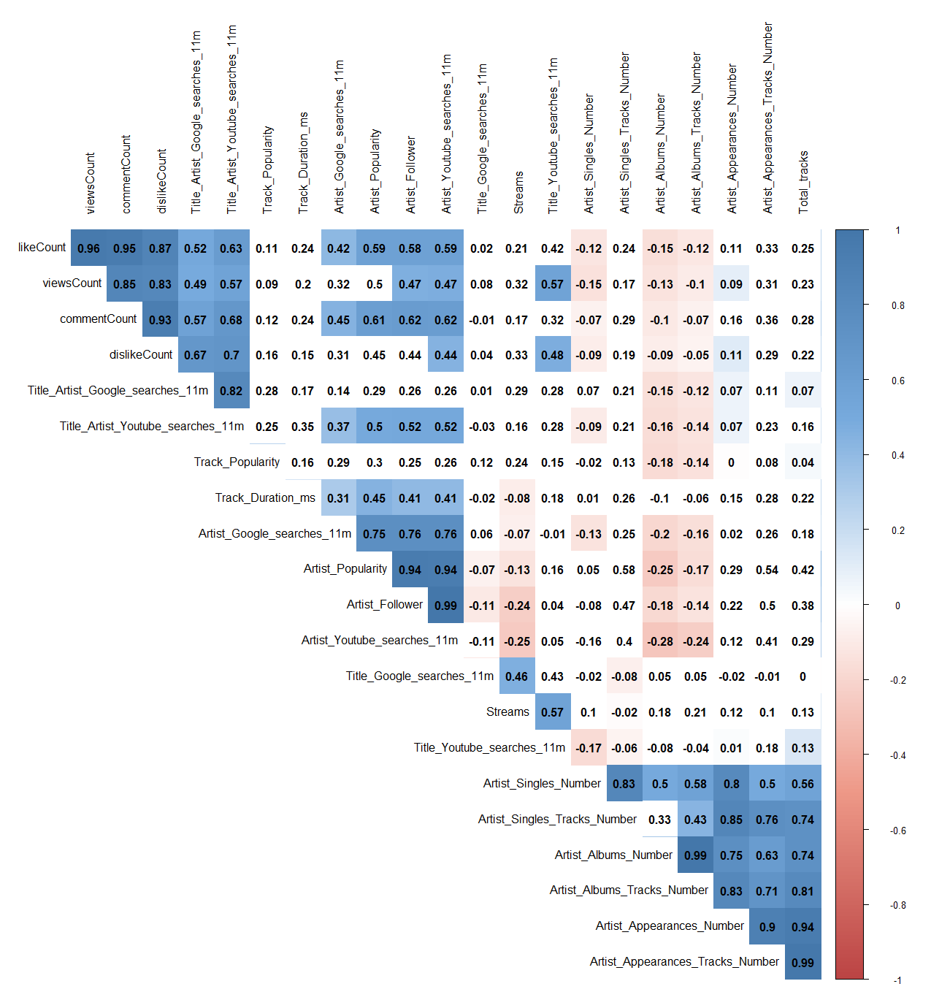

This is the mark-up file for the Datenanalyse 2 homework assignment.


```{r}
library("rio")
x <- import("https://docs.google.com/spreadsheets/d/1vsm3Had8R-6XWzh699PT2QxGwYbrXwXhLPCRt15PmqY/export?format=csv&gid=981990465")

```


```{r}
library("dplyr")

drop.cols <- c('Artist_ID', 'Genre', 'Release_Date', 'Track_Artist', 'Track_ID', 'Track_Title', 'video_ID')
numeric_x <- select(x, -one_of(drop.cols))

keep.cols <- c('Streams', 'Artist_Follower', 'Track_Duration_ms', 'Artist_Google_searches_11m', 'Title_Google_searches_11m',
               'viewsCount')

# keep.cols <- c('Streams', 'viewsCount', 'Title_Youtube_searches_11m')

selected_pairs <- select(x, keep.cols)

pairs(selected_pairs, cex=0.5)

```


```{r}

##1
library("rio")
x <- import("https://docs.google.com/spreadsheets/d/1vsm3Had8R-6XWzh699PT2QxGwYbrXwXhLPCRt15PmqY/export?format=csv&gid=981990465")

col <- ifelse(x$Genre == "Hip Hop", "black", "red")

plot(x$viewsCount, x$Streams, main="Music streams", pch=19, col=col)


```

```{r}

library("lattice")
xyplot(Streams~viewsCount|Genre, data=x, pch=19)

```

```{r}

library("ggplot2")
d <-ggplot(x, aes(x=viewsCount, y=Streams, colour=Genre))
d + geom_point(shape=19)

```

Using sunflower plot to overcome problem of overplotting.

```{r}

sunflower_viewsCount <- 2*round(x$viewsCount/2)
sunflower_streams  <- 2*round(x$Streams/2)
sunflowerplot(sunflower_streams~sunflower_viewsCount)

```

```{r}

cor <- cor(numeric_x)
drop.cor_cols <- c('Artist_Compilations_Number', 'Artist_Compilations_Tracks_Number')
numeric_cor_x <- select(numeric_x, -one_of(drop.cor_cols))

clean_cor <- cor(numeric_cor_x)
heatmap(clean_cor, revC=T, col=topo.colors(10))

```

```{r}
library("lattice")
levelplot(clean_cor, scales=list(x=list(rot=90)), aspect = "fill", col.regions=heat.colors(100))


```

```{r}
library("gplots")
gplots::heatmap.2(clean_cor, revC=T, na.rm=T)

```

Steiger's Z test for significance of (Bravais-Pearson) correlation coefficients 

```{r}

library(corrplot)

corrplot(clean_cor, method="circle")

cor.mtest <- function(mat, ...) {
  mat <- as.matrix(mat)
  n <- ncol(mat)
  p.mat<- matrix(NA, n, n)
  diag(p.mat) <- 0
  for (i in 1:(n - 1)) {
    for (j in (i + 1):n) {
      tmp <- cor.test(mat[, i], mat[, j], ...)
      p.mat[i, j] <- p.mat[j, i] <- tmp$p.value
    }
  }
  colnames(p.mat) <- rownames(p.mat) <- colnames(mat)
  p.mat
}
# matrix of the p-value of the correlation
#p.mat <- cor.mtest(clean_cor)

#col <- colorRampPalette(c("#BB4444", "#EE9988", "#FFFFFF", "#77AADD", "#4477AA"))
#significance_level <- 0.1

#corrplot(clean_cor, method="color", col=col(200),  
#         type="upper", order="hclust", 
#         addCoef.col = "black", # Add coefficient of correlation
#         tl.col="black", tl.srt=90, #Text label color and rotation
#         # Combine with significance
#         p.mat = p.mat, sig.level = significance_level, insig = "blank", 
#         # hide correlation coefficient on the principal diagonal
#         diag=FALSE)


```




```{r}

cov_mat <- cov(numeric_cor_x)

```


